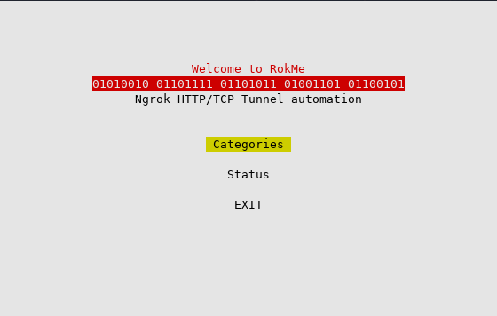
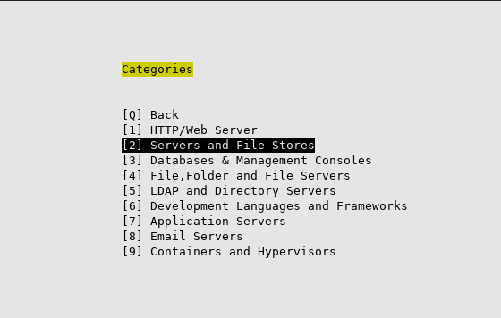
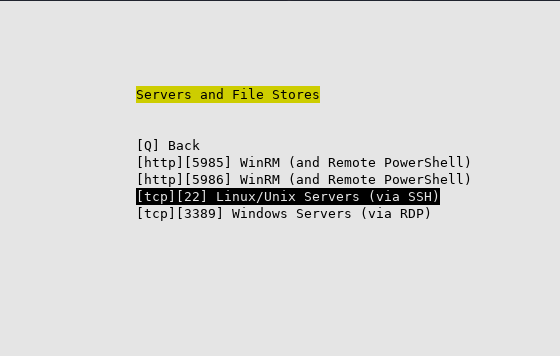
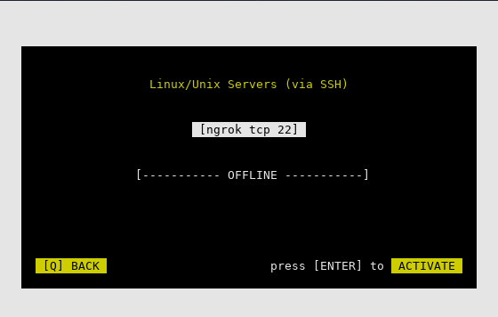
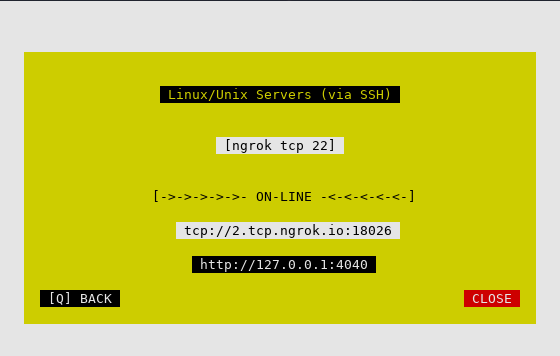
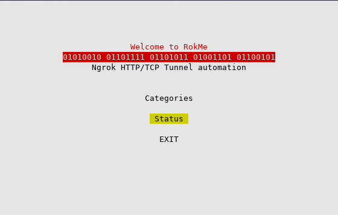
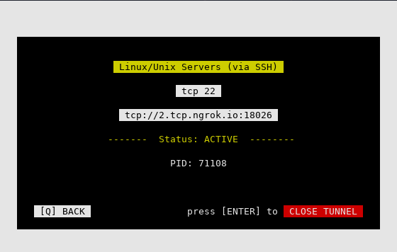
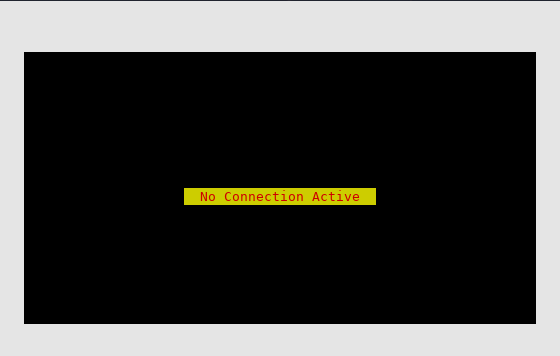

## Rokme

Simple tool for Ngrok Automation - wip

clone it and test it by running `python rokme.py` in the root folder


###### Install ngrok via **apt**
```sh
curl -s https://ngrok-agent.s3.amazonaws.com/ngrok.asc | sudo tee /etc/apt/trusted.gpg.d/ngrok.asc >/dev/null && echo "deb https://ngrok-agent.s3.amazonaws.com buster main" | sudo tee /etc/apt/sources.list.d/ngrok.list && sudo apt update && sudo apt install ngrok
```

###### Install ngrok via **snap**
```sh
snap install ngrok
```

###### Download **.TGZ** file
```sh
wget https://bin.equinox.io/c/bNyj1mQVY4c/ngrok-v3-stable-linux-amd64.tgz
```
then
```sh
sudo tar xvzf ~/Downloads/ngrok-v3-stable-linux-amd64.tgz -C /usr/local/bin
```
or you can vistit to the official [Download](https://ngrok.com/download) page on Ngrok website

---

###### Add authtoken

Once Ngrok is installed you have to set you authentication Token. Running this command will add your authtoken to the default `ngrok.yml` configuration file. This will grant you access to more features and longer session times.
Don't have an Authtoken? Go to [Ngrok.com](https://dashboard.ngrok.com/login)

```sh
 ngrok config add-authtoken <TOKEN>
```

## Categories







## Status



